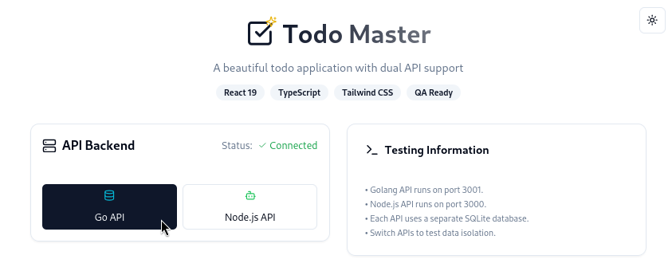
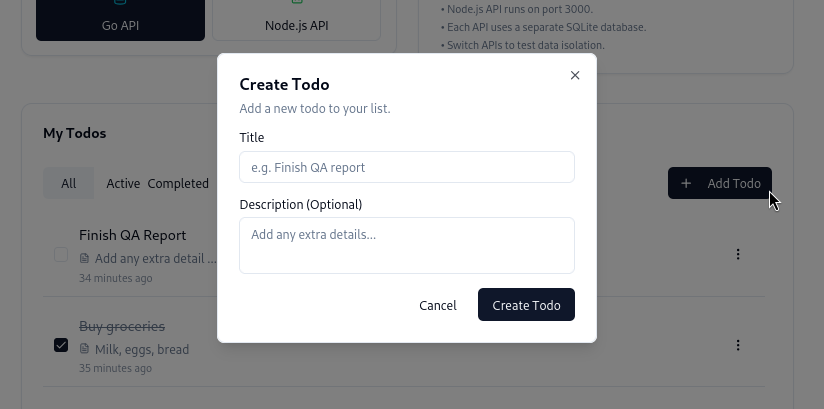
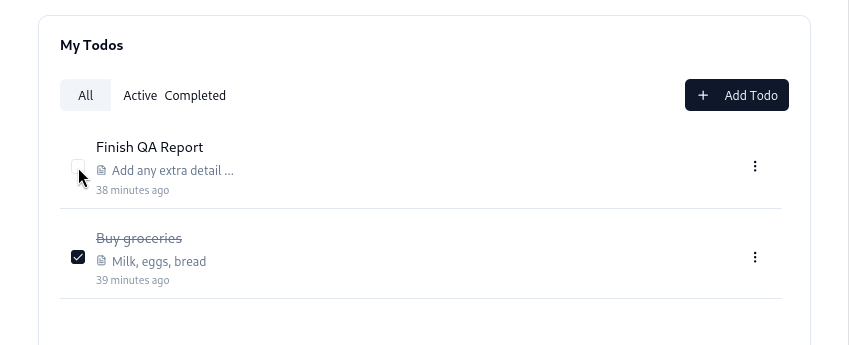
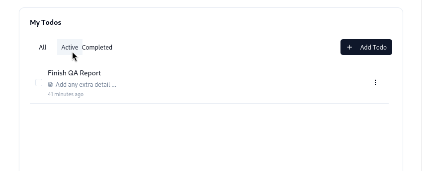

# 📝 Todo Master – Quickstart Guide

Welcome to **Todo Master**, a simple and efficient app for managing your daily tasks. This quickstart guide will help you get familiar with the core features:

1. Add a new todo  
2. Mark a todo as complete  
3. View only your active (incomplete) todos  

No setup or technical steps required—just follow the instructions below.

---

## 🔄 Switching Between Todo Lists

Todo Master supports **two independent task lists**, backed by different systems: **Node.js** and **Golang**. Each has its own database, so tasks added in one don’t appear in the other.

This is helpful if you want to keep different kinds of tasks separate—for example, personal and work-related todos.

To switch between lists:

- Click **Node.js API** or **Golang API** at the top of the page.
- A green **Connected** status means the list is active and ready to use.

You can switch at any time—your data will be preserved in both.

---

## ✅ 1. Add a New Todo
Capture tasks as soon as they come to mind — Todo Master makes it quick and effortless.

1. Click the **+ Add Todo** button in the **My Todos** section.  
2. A popup form will appear.  
3. Enter a **Title** (required) and a **Description** (optional).  
4. Click **Create Todo** to save it.

Your new task will appear immediately in the list.

---

## ☑️ 2. Mark a Todo as Complete
As you finish tasks, mark them complete to maintain a sense of progress and focus on what’s left.

1. Find the todo you want to complete.  
2. Click the **checkbox** next to its title.

The task will be marked visually (with a strikethrough).  
You can uncheck it later to mark it as active again.

---

## 🔍 3. View Only Active Todos

When your list grows longer, filtering helps you focus on what still needs your attention.

To view only active (incomplete) tasks:

1. Navigate to the **My Todos** section.  
2. At the top, click the **Active** tab.

This filters the list to show only tasks that haven’t been marked complete.

You can switch views at any time:

- **All** — to see every task  
- **Completed** — to review what’s already done

---

## ✅ That’s It!

With Todo Master, you can:

- Quickly add and organize tasks  
- Keep separate lists using the toggle feature  
- Track what’s done and what still needs attention  

All changes are saved automatically, so there's no need to refresh or submit anything manually.

You're now ready to manage your todos with ease.
